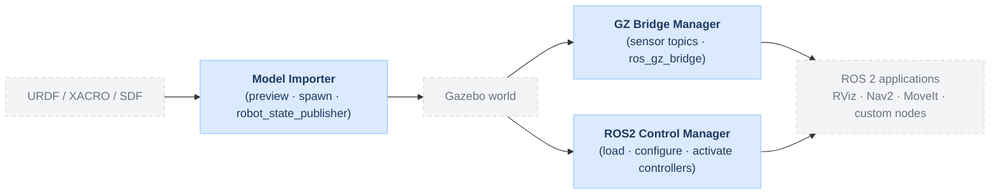

# gz_ros2_control_manager

Gazebo Harmonic GUI plugin for ROS 2 Jazzy that discovers `ros2_control` controller managers, shows loaded and configured controllers, and lets the user load, configure, and activate them directly from the Gazebo UI.

## Gazebo ROS 2 Model Runtime Suite

This package is part of the **Gazebo ROS 2 Model Runtime Suite** where each module has its own independency:

- **[ROS2 Control Manager](https://github.com/asoriano1/gz_ros2_control_manager)** (`gz_ros2_control_manager`)
  Discovers `controller_manager` instances, hardware interfaces, and controllers, and provides a UI to load, configure, and activate existing controllers.
- [Model Importer](https://github.com/asoriano1/gz_model_importer_plugin) (`gz_model_importer_plugin`) — imports URDF / XACRO / SDF models with preview, spawn, and optional `robot_state_publisher`.
- [GZ Bridge Manager](https://github.com/asoriano1/gz_ros2_bridge_manager) (`gz_ros2_bridge_manager`) — discovers active sensor topics and launches ROS 2 bridges.

This repository provides the **ROS2 Control Manager** module.



## What It Does

- Discovers all `controller_manager` instances running in the Gazebo world by scanning ROS 2 services
- Shows loaded controllers with their lifecycle state (`active`, `inactive`, `unconfigured`) and an action button for each
- Shows controllers declared in the `controller_manager` parameters but not yet loaded, with a **Load inactive** button
- Shows hardware components and interfaces (command / state) in debug mode
- Supports load → configure → activate and deactivate → stop flows
- Auto-refreshes on a configurable interval

## Requirements

- Ubuntu 24.04
- ROS 2 Jazzy
- Gazebo Harmonic (`gz-sim8`, `gz-gui8`)
- `gz_ros2_control` (`ros-jazzy-gz-ros2-control`)
- `ros2_controllers` (`ros-jazzy-ros2-controllers`)

## Build

```bash
cd <workspace>
source /opt/ros/jazzy/setup.bash
colcon build --packages-select gz_ros2_control_manager
source install/setup.bash
```

Sourcing `install/setup.bash` automatically sets:
- `GZ_GUI_PLUGIN_PATH` — so Gazebo finds `libControlManagerPlugin.so`
- `GZ_SIM_SYSTEM_PLUGIN_PATH` — so Gazebo finds `libgz_ros2_control-system.so`

## Demo

Run the bundled differential-drive demo:

```bash
ros2 launch gz_ros2_control_manager control_manager_demo.launch.py
```

This spawns a `diffbot` in an empty world with `gz_ros2_control` configured. Use the GUI to:

1. **Load inactive** `joint_state_broadcaster`
2. **Activate** `joint_state_broadcaster`
3. **Load inactive** `diff_drive_controller`
4. **Activate** `diff_drive_controller`

Then move the robot (ROS 2 Jazzy: `diff_drive_controller` uses `TwistStamped`):

```bash
ros2 topic pub /diffbot/diff_drive_controller/cmd_vel \
  geometry_msgs/msg/TwistStamped \
  "{header: {stamp: {sec: 0}, frame_id: ''}, twist: {linear: {x: 0.2}, angular: {z: 0.0}}}" \
  -r 10
```

### Launch arguments

| Argument | Default | Description |
|---|---|---|
| `robot_xacro_path` | bundled diffbot | Absolute path to a custom URDF / XACRO to spawn |
| `namespace` | `diffbot` | ROS namespace — must match `<ros><namespace>` in the URDF |
| `x`, `y`, `z` | `0 0 0.11` | Spawn pose |
| `paused` | `false` | Start simulation paused |
| `gui` | `true` | Launch Gazebo GUI with the panel |
| `bridge_clock` | `true` | Bridge `/clock` for `use_sim_time` support |

## Using With Your Own Robot

Any robot whose URDF embeds the `gz_ros2_control::GazeboSimROS2ControlPlugin` system plugin will be discovered automatically on Refresh.

Add this block to your URDF (inside `<gazebo>`):

```xml
<gazebo>
  <plugin filename="libgz_ros2_control-system.so"
          name="gz_ros2_control::GazeboSimROS2ControlPlugin">
    <parameters>$(find my_robot_description)/config/controllers.yaml</parameters>
    <ros>
      <namespace>/$(arg namespace)</namespace>
    </ros>
  </plugin>
</gazebo>
```

### Controller YAML must use the `/**` namespace wildcard

Controllers running in a non-root namespace (e.g. `/my_robot/controller_manager`) will not receive parameters from a YAML that uses a bare node name at the top level. Always wrap with `/**`:

```yaml
# CORRECT — applies to any namespace
/**:
  controller_manager:
    ros__parameters:
      update_rate: 50
      my_controller:
        type: my_pkg/MyController

/**:
  my_controller:
    ros__parameters:
      some_param: value
```

```yaml
# WRONG — only applies to root namespace /controller_manager
controller_manager:
  ros__parameters:
    ...
```

## Manual Gazebo Start

If you want to add the panel to an existing Gazebo session:

```bash
gz sim <your_world.sdf> \
  --gui-config $(ros2 pkg prefix gz_ros2_control_manager)/share/gz_ros2_control_manager/config/control_manager.config
```

## How Discovery Works

The plugin scans all ROS 2 services for names ending in `/controller_manager/list_controllers`. Each match is treated as one `controller_manager` instance. From its path, the plugin derives the ROS namespace and calls:

- `list_controllers` — loaded controllers and their lifecycle states
- `list_hardware_interfaces` — command and state interfaces (debug mode)
- `list_hardware_components` — hardware components (debug mode)
- `list_parameters` + `get_parameters` — controllers declared in parameters but not yet loaded

No ECM access, no SDF parsing, no URDF parsing — purely ROS 2 service calls.

## Notes

- In ROS 2 Jazzy, `diff_drive_controller` subscribes to `TwistStamped`, not `Twist`. The `use_stamped_vel` parameter was removed in `ros2_controllers 4.x`.
- The panel performs a single-slot serialisation: only one operation (refresh or switch) runs at a time to keep the `controller_manager` state consistent.
- `GZ_SIM_SYSTEM_PLUGIN_PATH` is set automatically by the env-hook when the workspace is sourced. This means `libgz_ros2_control-system.so` is discoverable by Gazebo regardless of how it is launched — no need to set this variable manually.

## Author

Ángel Soriano — [Robotnik Automation S.L.L.](https://robotnik.es)
